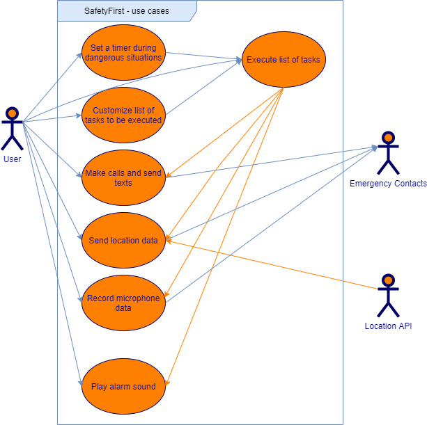

# SafetyFirst

## Project Abstract 
The goal of this project is to provide the user with a multitude of features to keep the user safe during unsafe situations. For example, it can be frightening walking home by oneself late at night, especially if there are no contingency plans in place if one were to encounter a dangerous situation. The app will contain a multitude of features that make it easy for the user to call for help and stay safe. In one such feature, the user will set a timer before they enter into a dangerous situation, such as walking home alone late at night. If the user does not indicate that they are safe before the timer expires, a list of any number of available functions (as customized beforehand by the user) will be carried out automatically. Options for functions to be carried out will include texting or calling emergency contacts, sending location data to emergency contacts, recording sound through the microphone, or playing an alarm sound to scare any potential attackers away. Other features and functions may be added depending on their usefulness and available time. The app will contain a User Interface designed to make each feature easily and quickly accessible.

## Project Relevance
The project will allow the developers to demonstrate many important topics covered in Software Design and develop several skills that are important for designing software in a professional environment. The project is a smartphone app that will feature a fully functional Graphic User Interface, and an Object Oriented Design will be used to develop the interface, as well as the inner workings of the app. The development will follow Test Driven Development, an important topic in Software Design, in order to ensure there are no errors or bugs that might affect the user's safety. Unified Modeling Language (UML) will be utilized to plan the structure of the Object Oriented Design of the project, and Java will likely be used to develop most or all of the program. Because the app needs to acquire location information, it will need to communicate with an external location services API, such as Google Maps, in order to accomplish this. This will utilize the very important skills of communicating with external services, establishing internet connections, and sending data over these connections. The app will likely also need to access APIs provided by the operating system in order to access the phone's microphone, contacts, and texting/calling services. Git will be utilized for version control and product releases, and multiple version may need to be developed in order to be compatible with multiple operating systems.

## Conceptual Design
The project will be built from scratch, so all aspects of the app will be developed by the group. 

## Background
https://github.com/ryan-mcgregor/SafetyFirst

## Required Resources
- Group members will need to be proficient in Java and capable of contributing to a Test-Driven, Object-Oriented Design. 
- Experience with Android Studio or other mobile app software development kits would be helpful.
- Familarity with Graphical User Interface (GUI) development would be beneficial.
- Experience with the Google Maps API or other location services APIs would be preferred.
- Access to at least one smart phone will be required in order to test the app in its intended environment. Access to at least one android phone and one IOS phone is preferred.
